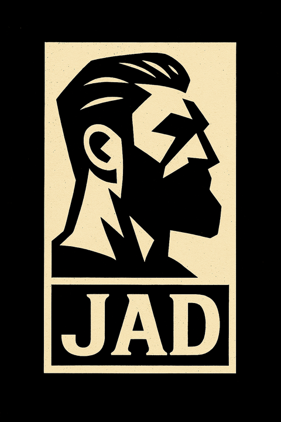
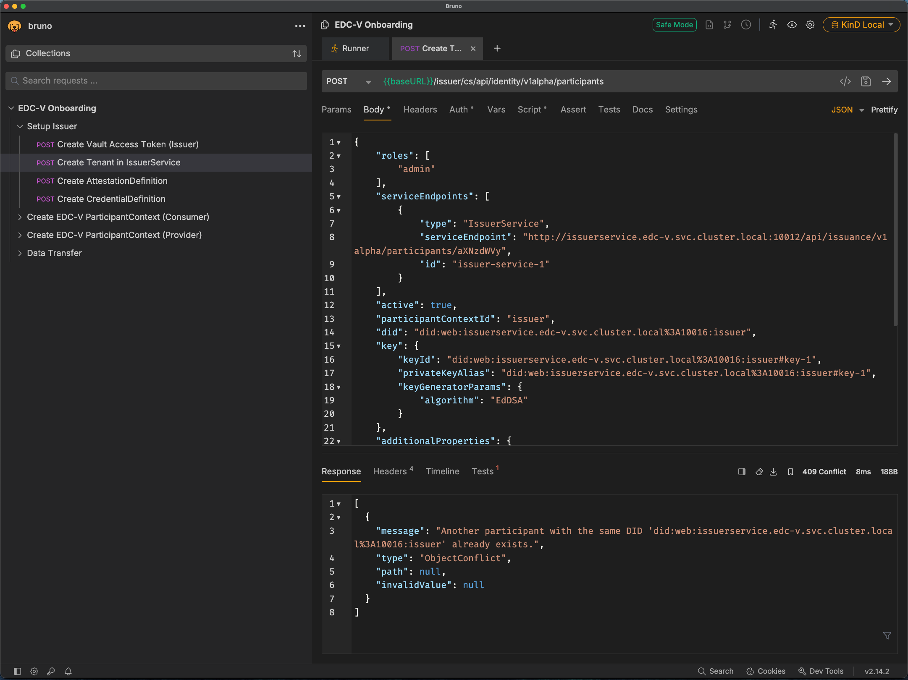
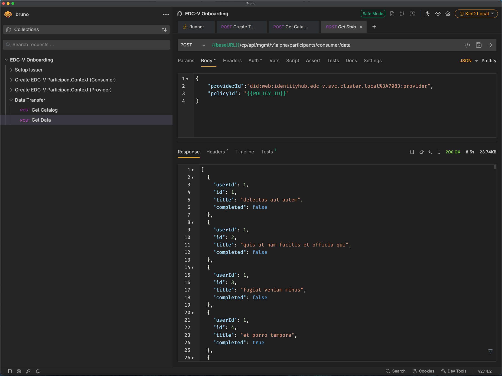
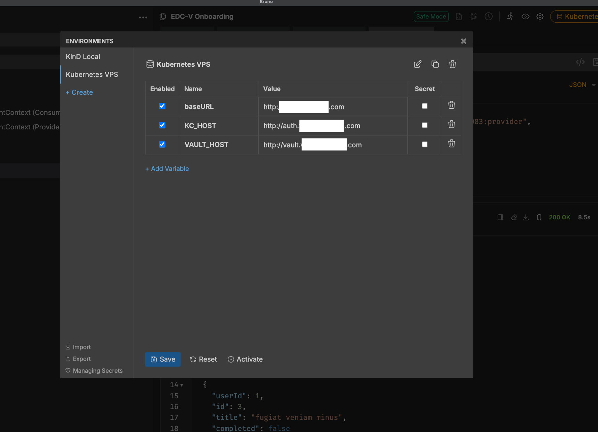

# JAD—Just Another Demonstrator

JAD is a demonstrator that deploys a fully-fledged dataspace as a Software-as-a-Service (SaaS) solution in Kubernetes.
This is to illustrate how Cloud Service Providers (CSPs) can deploy and manage dataspace components in their own cloud
infrastructure.

For that, JAD uses the "Virtual Connector" project: https://github.com/eclipse-edc/Virtual-Connector

Such a dataspace requires – at a minimum – the following components:

- a control plane: handles protocol messages and catalog data for each participant
- IdentityHub: responsible for managing Verifiable Credentials (presentation and storage)
- IssuerService: issues Verifiable Credentials to participants' IdentityHubs
- a data plane: performs the actual data transfer
- an identity provider: handles API authentication of management APIs. We are using Keycloak here.
- a vault: used to securely store sensitive data, such as the private keys etc. We are using Hashicorp Vault.
- a database server: contains persistent data of all the components. We are using PostgreSQL.
- a messaging system: used to process asynchronous messages. We are using NATS for this.

## Required tools and apps

- KinD: a basic Kubernetes runtime inside a single Docker container.
- Java 17+
- Docker
- `kubectl`
- macOS or Linux as an operating system. **Windows is not natively supported**!
- a POSIX-compliant shell (e.g., bash, zsh)
- [Bruno](https://www.usebruno.com) (or similar). The API requests here are optimized for Bruno, but other tools work as
  well. Bruno does offer a CLI client, but that does not handle token refresh automatically, so we'll use the GUI.
- [optional]: a Kubernetes monitoring tool like K9S, Lens, Headlamp, etc. Not required, but certainly helpful.

_All shell commands are executed from the root of the project unless stated otherwise._

## Getting started

### 1. Create KinD cluster

To create a KinD cluster, run:

```shell
cp ~/.kube/config ~/.kube/config.bak # to save your existing kubeconfig
kind create cluster -n edcv --config kind.config.yaml --kubeconfig ~/.kube/edcv-kind.conf
ln -sf ~/.kube/edcv-kind.conf ~/.kube/config # to use KinD's kubeconfig
```

There are pre-built images for JAD available for all components and it is recommended to use these. However, if you want
to build them from source, for example, because you modified the code and want to see it in action, you can do so by
following the following steps:

- build Docker images:
  ```shell
  ./gradlew dockerize
  ```
  This will build the Docker images for all components and store them in the local Docker registry. JAD requires a
  special version of PostgreSQL. In particular, it install the `wal2json` extension. You can create this
  special postgres version by running

  ```shell
  docker buildx build -f launchers/postgres/Dockerfile --platform linux/amd64,linux/arm64 -t ghcr.io/metaform/jad/postgres:wal2json launchers/postgres
  ```

  this will create the image `postgres:wal2json` for both amd64 and arm64 (e.g. Apple Silicon) architectures.

- load images into KinD

  KinD has no access to the host's docker context, so we need to load the images into KinD. Verify that all images are
  there by running `docker images`. Then run:

  ```shell
  kind load docker-image \
      ghcr.io/metaform/jad/controlplane:0.16.0-SNAPSHOT \
      ghcr.io/metaform/jad/identity-hub:0.16.0-SNAPSHOT \
      ghcr.io/metaform/jad/issuerservice:0.16.0-SNAPSHOT \
      ghcr.io/metaform/jad/dataplane:0.16.0-SNAPSHOT \
      ghcr.io/metaform/jad/postgres:wal2json -n edcv
  ```
  or if you're a bash god:
  ```shell
  kind load docker-image -n edcv $(docker images --format "{{.Repository}}:{{.Tag}}" | grep '^ghcr.io/metaform/jad/')
  ```

- modify the deployment manifests `controlplane.yaml`, `dataplane.yaml`, `identityhub.yaml`, `issuerservice.yaml` and
  `postgres.yaml` and set `imagePullPolicy: Never` to force KinD to use the local images.

### 2. Deploy the services

JAD uses plain Kubernetes manifests to deploy the services and Kustomize to configure the order. All the manifests are
located in the [deployment](./deployment) folder.

```shell
kubectl apply -k k8s/
```

This deploys all the services in the correct order. The services are deployed in the `edcv` namespace. Please verify
that everything got deployed correctly by running `kubectl get deployments -n edcv`. This should output something like:

```text
NAME            READY   UP-TO-DATE   AVAILABLE   AGE
controlplane    1/1     1            1           66m
dataplane       1/1     1            1           66m
identityhub     1/1     1            1           66m
issuerservice   1/1     1            1           66m
keycloak        1/1     1            1           66m
nats            1/1     1            1           66m
postgres        1/1     1            1           66m
vault           1/1     1            1           66m
```

### 3. Inspect your deployment

- database: the PostgreSQL database is accessible from outside the cluster via
  `jdbc:postgresql://postgres.localhost/controlplane`, username `postgres`, password ``.
- vault: the vault is accessible from outside the cluster via `http://vault.localhost`, using token `root`.
- keycloak: access `http://keycloak.localhost/` and use username `admin` and password `admin`

### 4. Prepare the data space

On the dataspace level, a few bits and pieces are required for it to become operational. These can be put in
place by running the REST requests in the `Setup Issuer` folder in
the [Bruno collection](./requests/EDC-V%20Onboarding). Be sure to select the `"KinD Local"` environment in Bruno.



Those requests can be run manually, one after the other, or via Bruno's "Run" feature. It may be necessary to manually
refresh the access token in the `"Auth*"` tab.

Next, we need to create a consumer and a provider participant. For this, we can also use Bruno, using the
`"Create EDC-V ParticipantContext (Consumer/Provider)"`
folder in the same collection. Again, make sure to select the `"KinD Local"` environment.

This sets up accounts in the IssuerService, the IdentityHub and the ControlPlane, plus it issues the
`MembershipCredential` to each new participant. It also seeds dummy data to each participant, specifically an Asset, a
Policy and a ContractDefinition.

## Transfer Data

EDC-V offers a one-stop-shop API to transfer data. This is achieved by two endpoints, one that fetches the catalog (
`Data Transfer/Get Catalog`) and another endpoint (`Data Transfer/Get Data`) that initiates the contract negotiation,
waits for its successful completion, then starts the data transfer.

Perform the entire sequence by running both requests in the `Data Transfer` folder in Bruno:



This will request the catalog, which contains exactly one dataset, then initiates contract negotiation and data
transfer for that asset. If everything went well, the output should contain demo output
from https://jsonplaceholder.typicode.com/todos, something like:

```json lines
[
  {
    "userId": 1,
    "id": 1,
    "title": "delectus aut autem",
    "completed": false
  },
  {
    "userId": 1,
    "id": 2,
    "title": "quis ut nam facilis et officia qui",
    "completed": false
  },
  //...
]
```

## Cleanup

To remove the deployment, run:

```shell
kubectl delete -k k8s/
```

## Deploying JAD on a bare-metal/cloud-hosted Kubernetes

KinD is geared towards local development and testing. If you want to deploy JAD on a bare-metal or cloud-hosted
Kubernetes cluster, there are some caveats to keep in mind.

### Configure DNS

EDC-V, Keycloak and Vault will need to be accessible from outside the cluster. This can be done by configuring DNS
entries for the services, e.g. `http://auth.yourdomain.com/`, `http://vault.yourdomain.com/` etc. This will depend on
your DNS provider. All entries should point to the IP address of the Kubernetes host.

### Create Bruno Environment

Some of the URL paths used in Bruno are hard coded to `localhost` and compartmentalized in a Bruno environment.
Create another environment to suit your setup:



### Update deployment manifests

in [keycloak.yaml](k8s/base/keycloak.yaml) and [vault.yaml](k8s/base/vault.yaml), update the `host` fields in the
`Ingress`
resources to match your DNS:

```yaml
spec:
  rules:
    - host: keycloak.localhost # change to: auth.yourdomain.com
      http:
```

Next, in the [controlplane-config.yaml](k8s/apps/controlplane-config.yaml) change the expected issuer URL to match your
DNS:

```yaml
edc.iam.oauth2.issuer: "http://keycloak.localhost/realms/edcv" # change to "http://auth.yourdomain.com/realms/edcv"
```

### Tune readiness probes

Readiness probes are set up fairly tight to avoid long wait times on local KinD clusters. However, in some Kubernetes
clusters, these may need to be tuned to allow for longer periods and/or larger failure thresholds. We've seen this in
particular with KeyCloak, because it takes some time to fully start up.

If the thresholds are too tight, then Keycloak may get hung up in an endless restart loop—Kubernetes kills the pod
before it reaches a healthy state.

To start, edit the `readinessProbe` section of the `keycloak` deployment manifest:

```yaml
# keycloak.yaml, Line 79ff
   readinessProbe:
     httpGet:
       path: /health/ready
       port: 9000
     initialDelaySeconds: 30 # changed
     periodSeconds: 10 # changed
     successThreshold: 1
     failureThreshold: 15 # changed
   livenessProbe:
     httpGet:
       path: /health/live
       port: 9000
     initialDelaySeconds: 30 # changed
     periodSeconds: 10 # changed
     successThreshold: 1
     failureThreshold: 15 # changed
```


