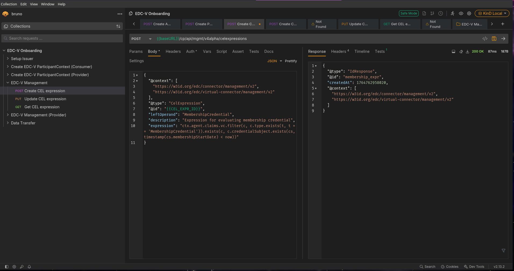
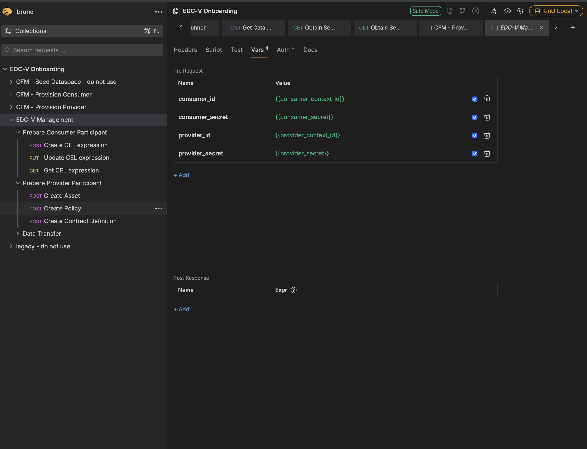
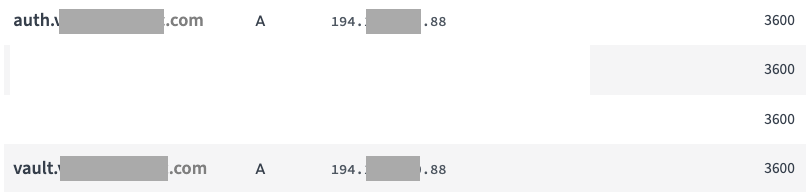

# JAD—Just Another Demonstrator

JAD is a demonstrator that deploys a fully-fledged dataspace as a Software-as-a-Service (SaaS) solution in Kubernetes.
This is to illustrate how Cloud Service Providers (CSPs) can deploy and manage dataspace components in their own cloud
infrastructure.

For that, JAD uses the "Virtual Connector" project: <https://github.com/eclipse-edc/Virtual-Connector>

> For the conceptual guide that JAD brings to life, see
> [Operating Multi-Tenant Dataspace Environments](https://dataspacebuilder.github.io/website/guides/ops-multi-tenant-ds-env-guide).

## The scenario

A **Cloud Service Provider** ("JAD Service Provider") operates a multi-tenant dataspace platform. Two companies want to
join a shared dataspace to exchange data:

- **Demo Consumer Company** — needs to discover and consume data from partners
- **Demo Provider Company** — publishes data offerings that other participants can access under policy-controlled terms

JAD walks through the full lifecycle: from deploying the platform infrastructure, through onboarding both
organizations, to executing a data transfer where the Consumer proves it holds a valid Membership Credential before
receiving the Provider's data.

Along the way, you will step into three distinct roles:

| Role | What you do | When |
|------|-------------|------|
| **Operator** | Deploy Kubernetes, databases, secrets, networking, and the application layer. Own the platform infrastructure. | [Part 1: Deploy the platform](#part-1-deploy-the-platform-operator) |
| **Provisioner** | Onboard participants via the Connector Fabric Manager (CFM). Create their runtime contexts, credentials, and identity. | [Part 2: Onboard participants](#part-2-onboard-participants-provisioner) |
| **Participant** | Manage your own catalogs, policies, contracts, and data flows. Operate independently through your Virtual Participant Agent (VPA). | [Part 3: Operate as a participant](#part-3-operate-as-a-participant) |

> **Key principle**: Operationally, onboarding and lifecycle management are centralized (Operator + Provisioner), while
> trust and sharing decisions remain fully decentralized between Participants. The CFM provisions contexts but is
> **not** in the trust-decision path.

## Architecture overview

JAD's components are organized in three layers:

```
┌─────────────────────────────────────────────────────────────────────┐
│                      Runtime Plane (EDC-V)                         │
│  Control Plane · IdentityHub · IssuerService · Data Plane          │
│  → Trust and sharing: protocol endpoints, policy evaluation,       │
│    credential exchange, data execution                             │
├─────────────────────────────────────────────────────────────────────┤
│                   Management Plane (CFM)                           │
│  tenant-manager · provision-manager · agents                       │
│  → Automation: provisions participant contexts but is NOT in       │
│    the trust-decision path                                         │
├─────────────────────────────────────────────────────────────────────┤
│                      Infrastructure                                │
│  PostgreSQL · Hashicorp Vault · Keycloak · NATS                    │
│  → Reliability primitives: storage, secrets, identity, messaging   │
└─────────────────────────────────────────────────────────────────────┘
```

The critical design insight: the Management Plane (CFM) can be completely unavailable without stopping active data
sharing. Once participants are onboarded, trust decisions flow peer-to-peer through the Runtime Plane.

## Required tools and apps

- KinD: a basic Kubernetes runtime inside a single Docker container.
- Java 17+
- Docker
- `kubectl`
- Helm (for Traefik installation)
- macOS or Linux as an operating system. **Windows is not natively supported**!
- a POSIX-compliant shell (e.g., bash, zsh)
- [Bruno](https://www.usebruno.com) (or similar). The API requests here are optimized for Bruno, but other tools work as
  well. Bruno does offer a CLI client, but that does not handle token refresh automatically, so we'll use the GUI.
- [optional]: a Kubernetes monitoring tool like K9S, Lens, Headlamp, etc. Not required, but certainly helpful.

_All shell commands are executed from the root of the project unless stated otherwise._

---

## Part 1: Deploy the platform (Operator)

As the **Operator**, you deploy the cloud-native infrastructure and the application layer. This is the foundation that
will host all participants.

### 1.1 Create a KinD cluster

To create a KinD cluster, run:

```shell
cp ~/.kube/config ~/.kube/config.bak # to save your existing kubeconfig
kind create cluster -n edcv --kubeconfig ~/.kube/edcv-kind.conf
ln -sf ~/.kube/edcv-kind.conf ~/.kube/config # to use KinD's kubeconfig
```

Next, we need to deploy a Gateway controller to allow access to services from outside the cluster. There are several
popular choices, and we've opted for [Traefik](https://doc.traefik.io/traefik/setup/kubernetes/) in this case. We could
have gone for Envoy, but Traefik is easier to set up and lighter-weight.

```shell
helm repo add traefik https://traefik.github.io/charts
helm repo update
helm upgrade --install --namespace traefik traefik traefik/traefik --create-namespace -f values.yaml
```

Then, install the custom resource definitions (CRDs) for the Gateway API:

```shell
kubectl apply --server-side --force-conflicts -f https://github.com/kubernetes-sigs/gateway-api/releases/download/v1.4.1/experimental-install.yaml
```

#### Enable network access to services

With the Gateway API, there are three main ways to access services from outside the cluster:

- using port-forwarding: this is a manual way to forward ports from the host to the cluster. This is not
  recommended for production use but works fine for local testing. We will use this approach here for simplicity.

- via a LoadBalancer service: this is typically used in cloud-hosted Kubernetes clusters, where the cloud provider
  provisions a load balancer automatically. This is the recommended approach for production use when running in
  cloud-hosted environments, and DNS names are used. For KinD, there is no built-in load balancer, but one can be
  installed

- via `NodePort` services: this exposes services on high-numbered ports on the host machine. This is not
  recommended for production use, and it gets complicated quickly when multiple services are involved, as is the case
  here. _This is not shown here_.

##### Option 1 (recommended): via port-forwarding

To set up port-forwarding, run the following command:

```shell
kubectl -n traefik port-forward svc/traefik 80
```

This forwards port 80 from the host to the Traefik service inside the cluster. You may need to run this with `sudo`
privileges on some systems.

##### Option 2: via LoadBalancer (alternative)

The KinD project provides
a [cloud-like load balancer implementation](https://github.com/kubernetes-sigs/cloud-provider-kind). It emulates an
external LB as you would get on cloud-hosted K8s clusters.
Install it according to the instructions in the repository.

Verify, that the `EXTERNAL-IP` of the `traefik` service is not yet assigned:

```shell
kubectl get svc -n traefik
NAME      TYPE           CLUSTER-IP      EXTERNAL-IP   PORT(S)                      AGE
traefik   LoadBalancer   10.96.251.221   <pending>     80:31415/TCP,443:31650/TCP   22s
```

To assign an IP address to the Traefik LoadBalancer service, we need to run the external LB:

```shell
cloud-provider-kind
# on macOS:
sudo cloud-provider-kind
```

Now, if we rerun the previous command, we should see a similar output to this:

```shell
kubectl get svc -n traefik
NAME      TYPE           CLUSTER-IP      EXTERNAL-IP   PORT(S)                      AGE
traefik   LoadBalancer   10.96.251.221   172.18.0.3    80:31415/TCP,443:31650/TCP   2m31s
```

> Note that with the external LB, services inside the cluster must be accessed via the external IP address, e.g.
> `172.18.0.3` in this case. Variables inside the Bruno collection must be adjusted accordingly!

### 1.2 Deploy applications

#### Option 1: Use pre-built images

There are pre-built images for all JAD apps available from [GHCR](https://github.com/Metaform/jad/packages) and the
Connector Fabric Manager images are available from
the [CFM GitHub Repository](https://github.com/Metaform/connector-fabric-manager/packages). Those are tested and we
strongly recommend using them.

#### Option 2: Build images from source

However, for the adventurous among us who want to build them from source, for example, because they've modified the code
and now want to see it in action, please follow the following steps to build and load JAD apps:

- build Docker images:

  ```shell
  ./gradlew dockerize
  ```

  This will build the Docker images for all components and store them in the local Docker registry.

- load images into KinD: KinD has no access to the host's docker context, so we need to load the images into KinD. Note
  that other Kubernetes runtimes such as Minikube do things differently. Verify that all images are there by running
  `docker images`. Then run:

  ```shell
  kind load docker-image \
      ghcr.io/metaform/jad/controlplane:latest \
      ghcr.io/metaform/jad/identity-hub:latest \
      ghcr.io/metaform/jad/issuerservice:latest \
      ghcr.io/metaform/jad/dataplane:latest -n edcv
  ```

  or if you're a bash God:

  ```shell
  kind load docker-image -n edcv $(docker images --format "{{.Repository}}:{{.Tag}}" | grep '^ghcr.io/metaform/jad.*:latest')
  ```

- build CFM docker images locally:

  ```shell
  cd /path/to/cfm/
  make load-into-kind
  ```

  This builds all CFM components' docker images and loads them into your KinD cluster, assuming that your KinD cluster
  is named `"edcv"`. If not, set the cluster name for the make file accordingly:

  ```
  cd /path/to/cfm/
  make load-into-kind KIND_CLUSTER_NAME=your_cluster_name`.
  ```

  Note that individual `make` targets for all CFM components exist, for example `make load-into-kind-pmanager`.

- modify the deployment manifests of the components you want to load locally by setting the `imagePullPolicy: Never`
  which forces KinD to rely on local images rather than pulling them. This can be done with search-and-replace from your
  favorite editor, or you can do it from the command line by running

  ```shell
  sed -i "s/imagePullPolicy:.*Always/imagePullPolicy: Never/g" <FILENAME>
  ```

  **CAUTION Mac users**: this requires GNU-sed. By default, macOS, has a special version of `sed` so you will have
  to [install GNU sed first](https://medium.com/@bramblexu/install-gnu-sed-on-mac-os-and-set-it-as-default-7c17ef1b8f64)

- For the EDC-V components, the relevant files are `controlplane.yaml`, `dataplane.yaml`, `identityhub.yaml` and
  `issuerservice.yaml`
- as a simplification, and to modify the image pull policy of both EDC-V _and_ CFM components, run:

  ```shell
  grep -rlZ "imagePullPolicy: Always" k8s/apps  | xargs sed -i "s/imagePullPolicy:.*Always/imagePullPolicy: Never/g"
  ```

  For this, both the EDC-V and CFM docker images must be built locally!!

### 1.3 Deploy the services

JAD uses plain Kubernetes manifests to deploy the services. All the manifests are located in the [k8s](./k8s) folder.
While it is possible to just use the Kustomize plugin and running `kubectl apply -k k8s/`, you may experience nasty race
conditions because some services depend on others to be fully operational before they can start properly.

The recommended way is to deploy infrastructure services first, and application services second. This can be done
by running:

```shell
kubectl apply -f k8s/base/

# Wait for the infrastructure services to be ready:
kubectl wait --namespace edc-v \
            --for=condition=ready pod \
            --selector=type=edcv-infra \
            --timeout=90s

kubectl apply -f k8s/apps/

# Wait for seed jobs to be ready:
kubectl wait --namespace edc-v \
            --for=condition=complete job --all \
            --timeout=90s
```

Here's a copy-and-pasteable command to delete and redeploy everything:

```shell
kubectl delete -k k8s/; \
kubectl apply -f k8s/base && \
kubectl wait --namespace edc-v \
            --for=condition=ready pod \
            --selector=type=edcv-infra \
            --timeout=90s && \
kubectl apply -f k8s/apps && \
kubectl wait --namespace edc-v \
            --for=condition=complete job --all \
            --timeout=90s
```

_Note: the `";"` after `kubectl delete -k k8s/` is on purpose for robustness, to allow the command to fail if no
resources are deployed yet._

This deploys all the services in the correct order. The services are deployed in the `edc-v` namespace. Please verify
that everything got deployed correctly by running `kubectl get deployments -n edcv`. This should output something like:

```text
NAME            READY   UP-TO-DATE   AVAILABLE             AGE
cfm-agents                1/1     1            1           117m
cfm-provision-manager     1/1     1            1           117m
cfm-tenant-manager        1/1     1            1           117m
controlplane              1/1     1            1           117m
dataplane                 1/1     1            1           117m
identityhub               1/1     1            1           117m
issuerservice             1/1     1            1           117m
keycloak                  1/1     1            1           110m
nats                      1/1     1            1           110m
postgres                  1/1     1            1           110m
vault                     1/1     1            1           110m
```

### 1.4 Verify the platform

Before handing off to the Provisioner, verify that the infrastructure is healthy:

- database: the PostgreSQL database is accessible from outside the cluster via
  `jdbc:postgresql://postgres.localhost/controlplane`, username `cp`, password `cp`.
- vault: the vault is accessible from outside the cluster via `http://vault.localhost`, using token `root`.
- keycloak: access `http://keycloak.localhost/` and use username `admin` and password `admin`

**Caution: these are security-relevant credentials and must not be used in production! EVER!!**

In addition, you should see the following Kubernetes jobs (`k get jobs -n edcv`) running:

```text
NAME                       STATUS     COMPLETIONS   DURATION   AGE
issuerservice-seed         Complete   1/1           13s        119m
provision-manager-seed     Complete   1/1           15s        119m
vault-bootstrap            Complete   1/1           19s        120m
```

Those seed jobs bootstrap the platform with initial data:

| Seed job | What it does |
|----------|-------------|
| `vault-bootstrap` | Creates secret engines and initial credentials in Vault |
| `provision-manager-seed` | Seeds the CFM with platform-level configuration |
| `issuerservice-seed` | Configures the IssuerService to issue Verifiable Credentials |

> At this point, the **platform is running** but no participants exist yet. The Operator's job is done — time to hand
> off to the Provisioner.

---

## Part 2: Onboard participants (Provisioner)

As the **Provisioner**, you onboard organizations into the dataspace. This follows the
[participant onboarding journey](https://dataspacebuilder.github.io/website/guides/ops-multi-tenant-ds-env-guide)
described in the companion guide:

| Stage | What happens | How JAD does it |
|-------|-------------|-----------------|
| 1. Application | Organization applies to join the dataspace | _Out of scope — governance/legal process_ |
| 2. Verification | Legal, compliance, and business checks | _Out of scope — governance/legal process_ |
| 3. Tenant provisioning | Platform creates technical context | CFM creates `ParticipantContext` in Control Plane and IdentityHub, provisions Vault and API credentials |
| 4. Credential issuance | Governance-recognized issuer delivers Verifiable Credentials | CFM registers the participant with IssuerService and requests VCs |
| 5. Configuration | Participant sets up assets, policies, applications | _Handed off to Participant — see [Part 3](#part-3-operate-as-a-participant)_ |
| 6. Active participation | Catalog discovery, contract negotiation, data flows | _Handed off to Participant — see [Part 3](#part-3-operate-as-a-participant)_ |

### 2.1 Provision the Consumer and Provider

Run the REST requests in the `CFM - Provision Consumer` folder and in the `CFM - Provision Provider` folder
in the [Bruno collection](./requests/EDC-V%20Onboarding). Be sure to select the `"KinD Local"` environment in
Bruno.


Those requests can be run manually, one after the other, or via Bruno's "Run" feature. It may be necessary to manually
refresh the access token in the `"Auth*"` tab.

Behind the scenes, CFM automates stages 3 and 4 of the onboarding journey:

- creates access credentials for both the Vault and the Administration APIs
- creates a `ParticipantContext` in the control plane
- creates a `ParticipantContext` in IdentityHub
- registers the new `ParticipantContext` with the IssuerService
- requests VerifiableCredentials from the IssuerService

N.B.: the `Get Participant Profile` may need to be run repeatedly until all entries in the `vpas` array have a
`"state": "active"` field. This is because the deployment is an asynchronous process and all agents need to run before
the profile is activated.

> Both participants are now onboarded. The Provisioner's job is done — from here, each participant configures and
> operates their own context independently.

---

## Part 3: Operate as a participant

As a **Participant**, you manage your own catalogs, policies, and data flows. The Operator and Provisioner have no
visibility into or control over these trust-level decisions.

### 3.1 Configure the Consumer's policy engine

The Consumer needs a policy evaluation rule to enforce access control. EDC-V uses the CEL (Common Expression Language)
engine for this. We will create a simple CEL expression that allows data access only to participants that possess a
valid Membership Credential.

Run the requests in the `Create CEL expression` request in folder `EDC-V Management/Prepare consumer participant` in the
same Bruno collection to create the CEL expression in the ControlPlane.



### 3.2 Publish the Provider's data offerings

The Provider publishes what it wants to share and under what conditions. This means seeding an asset, a policy, and a
contract definition.

Run the requests in the `EDC-V Management/Provider` folder in the same Bruno collection. Again, make sure
to select the `"KinD Local"` environment.



**If all requests ran successfully, you should now have access credentials for both the consumer and the provider!**

### 3.3 Transfer data

Now the two participants interact **peer-to-peer** — the Consumer discovers the Provider's catalog, negotiates a
contract by proving it holds a valid Membership Credential, and receives the data. Neither the Operator nor the
Provisioner is involved in this exchange.

There are two use cases supported here:

#### Http proxy

EDC-V offers a one-stop-shop API to transfer data. This is achieved by two endpoints, one that fetches the catalog (
`Data Transfer/Http Todo/Get Catalog`) and another endpoint (`Data Transfer/Http Todo/Get Data`) that initiates the
contract negotiation,
waits for its successful completion, then starts the data transfer.

Perform the entire sequence by running both requests in the `Data Transfer/Http Todo` folder in Bruno:


This will request the catalog, which contains exactly one dataset, then initiates contract negotiation and data
transfer for that asset. If everything went well, the output should contain demo output
from <https://jsonplaceholder.typicode.com/todos>, something like:

```json lines
[
  {
    "userId": 1,
    "id": 1,
    "title": "delectus aut autem",
    "completed": false
  },
  {
    "userId": 1,
    "id": 2,
    "title": "quis ut nam facilis et officia qui",
    "completed": false
  }
  //...
]
```

#### Certificates sharing via HTTP

The second use case demonstrates how certificates can be shared between participants using EDC-V's HTTP data
transfer capabilities.

First we need to upload a certificate to the Provider. This is done by running the
`Data Transfer/Http Certs/Provider/Upload Certificate` request in Bruno:


by selecting a file to upload (e.g. a `.pdf` file). Additional metadata can be provided in the request body using
the `metadata` field.

Then perform the entire sequence by running both requests in the `Data Transfer/Http Certs/Consumer` folder in Bruno:


which:

- Fetches the catalog from the Provider storing the offer id for the certificate asset
- Setup the transfer request using the offer id (contract negotiation + transfer initiation) storing the access token
- Query the provider for listing the available certificates storing the first certificate id
- Finally, download the certificate using the certificate id

---

## Reference

### Automated tests

JAD comes with a set of automated tests that can be run against the deployed services. These tests are located in the
[tests/end2end](./tests/end2end) folder. To run them, deploy JAD without creating any resources, and then run the test
suite:

```shell
./gradlew test -DincludeTags="EndToEndTest"
```

This may be particularly useful if you want to tinker with the code base, add or change stuff and would like to see if
everything still works. Remember to rebuild and reload the docker images, though...

### Cleanup

To remove the deployment, run:

```shell
kubectl delete -k k8s/
```

### Troubleshooting

In case any errors occur referring to authentication or authorization, it is recommended to delete and re-deploy the
entire base and all apps.

For example, if a participant onboarding went only through half-way, we recommend to do a clean-slate redeployment.

In some cases, even deleting and re-creating the KinD cluster may be required.

### Deploying JAD on a bare-metal/cloud-hosted Kubernetes

KinD is geared towards local development and testing. For example, it comes with a bunch of useful defaults, such as
storage classes, load balancers, network plugins, etc. If you want to deploy JAD on a bare-metal or cloud-hosted
Kubernetes cluster, then there are some caveats to keep in mind.

#### Configure network access and DNS

EDC-V, Keycloak and Vault will need to be accessible from outside the cluster. For this, your cluster needs a network
plugin and an external load balancer. For bare-metal installations, consider using [MetalLB](https://metallb.io).

In addition, you'll likely want DNS resolution for your cluster so that individual services can be reached via
subdomains, e.g. `http://auth.yourdomain.com/`, `http://vault.yourdomain.com/`, `controlplane.yourdomain.com` etc.
This must be configured with your DNS provider, and the specifics will vary greatly from one to the next. All entries
should point to the IP address of the Kubernetes host, for example:



Each [component](#architecture-overview) of JAD has its own HTTP route (Kubernetes replacement for Ingress routes), so
it may be advisable to define DNS subdomains for each of them, for example:

- Control plane: `https://cp.yourdomain.com/` -> 194.123.456.88
- Identity Hub: `https://ih.yourdomain.com/` -> 194.123.456.88
- Keycloak: `https://auth.yourdomain.com/` -> 194.123.456.88
- Vault: `https://vault.yourdomain.com/` -> 194.123.456.88
- etc.

Where `194.178.218.88` is the IP address of the Kubernetes host running MetalLB (or similar).

_In actual production deployments, these individual hostnames, and potentially also individual IP addresses, would be
necessary to isolate security domains and prevent unauthorized access or privilege escalation._

#### Tune Traefik gateway controller

By default, Traefik binds to port 80 and 443 on the host machine. This is useful to enable clean URLs like
`http://tm.yourdomain.com/api/v1alpha1/cells` etc. without any ports. However, some Linux distributions don't allow
binding to well-defined ports to non-root users.

If that is the case (check Traefik's logs), adding the following snippet to `values.yaml` will fix the problem:

```yaml
hostNetwork: true
securityContext:
  capabilities:
    drop: [ ALL ]
    add: [ NET_BIND_SERVICE ]
  readOnlyRootFilesystem: true
  runAsGroup: 0
  runAsNonRoot: false
  runAsUser: 0
```

#### Create Bruno Environment

Some of the URL paths used in Bruno are hard coded to `localhost` in a Bruno environment named `KinD Local`. This is
tailored to running JAD on a local KinD cluster. To make the collection usable for a remote deployment, we recommend
duplicating the collection and replace the `localhost` references with the DNS names of the services.

Create another environment to suit your setup:


#### Update deployment manifests

in [keycloak.yaml](k8s/base/keycloak.yaml) and [vault.yaml](k8s/base/vault.yaml), update the `hostnames` fields in the
`HTTPRoute` resources to match your DNS:

```yaml
spec:
  parentRefs:
    - name: edcv-gateway
      kind: Gateway
      sectionName: http
  hostnames:
    - keycloak.localhost
    - auth.yourdomain.com
```

Do this for all `HTTPRoute` declarations in all components' manifests. The `hostnames` field should contain entries
matching your DNS subdomains that you have also used to create the new Bruno environment.

#### Update the Keycloak realm

In `k8s/base/keycloak.yaml`, find the line that says:

```text
"bound_issuer": "http://vault.localhost/realms/edcv"
```

and replace with

```text
"bound_issuer": "http://vault.yourdomain.com/realms/edcv"
```

This is crucial for Vault authentication to work properly.

#### Tune readiness probes

We've set up the readiness probes fairly tight, to avoid long wait times on local KinD clusters. However, in some
Kubernetes
clusters, these may need to be tuned to allow for longer periods and/or larger failure thresholds. In particular,
KeyCloak takes a long time to start up, sometimes several minutes depending on the hardware.
If the thresholds are too tight, then Keycloak may get hung up in endless restart loops: Kubernetes kills the pod
before it reaches a healthy state.

To start, edit the `readinessProbe` section of the `keycloak` deployment manifest:

```yaml
# keycloak.yaml
readinessProbe:
  httpGet:
    path: /health/ready
    port: 9000
  initialDelaySeconds: 30 # changed
  periodSeconds: 10 # changed
  successThreshold: 1
  failureThreshold: 15 # changed
livenessProbe:
  httpGet:
    path: /health/live
    port: 9000
  initialDelaySeconds: 30 # changed
  periodSeconds: 10 # changed
  successThreshold: 1
  failureThreshold: 15 # changed
```

### Using the OpenAPI specifications

We've included [OpenAPI specifications](./openapi) for all JAD components that expose REST APIs. We'll call those APIs
"Administration APIs" and you can read more about them in
the [EDC-V documentation](https://github.com/eclipse-edc/Virtual-Connector/blob/main/docs/administration_api.md).

Please note, that we've taken the liberty of curating the list of APIs to what we consider to be the most relevant for
the end-user. We have also prioritized deployment resilience, ensuring that it is difficult for users to accidentally
misconfigure their JAD deployment to the point of failure.

However, the complete specifications for each component, including modifying and thus potentially dangerous actions, can
be found in the respective GitHub repositories.

#### Intended audience

The curated OpenAPI specifications are intended for developers who have graduated beyond the use of
the [Bruno collection](./requests/EDC-V%20Onboarding) and want to integrate JAD components into their own applications
such as ERP systems, web UIs or other applications.

Another important use case is to generate server stubs for client applications to make testing independent of the JAD
deployment, and thus easier and more repeatable.

#### Swagger UI vs generated clients

Unfortunately, Keycloak rejects authorization requests from Swagger UI due to CORS restrictions. Therefore, we recommend
using these OpenAPI files to manually implement or generate client libraries for your programming language of choice.
One popular possibility to do that is
the [OpenAPI Generator project](https://github.com/OpenAPITools/openapi-generator).

The generator can be run in an ephemeral Docker container (amongst _many_ other options) to generate client stubs for
various languages. Below are some examples of how to use it, myriads more are available on the project's GitHub page.

**Example 1: generate a Java client using OkHttp and Gson**:

```shell
docker run --rm -v "${PWD}/openapi:/local" openapitools/openapi-generator-cli generate \
    -i /local/identity-api.yaml \
    -g java \
    --library okhttp-gson \
    -o /local/out/java
```

**Example 2: generate a TypeScript client using Angular**:

```shell
docker run --rm -v "${PWD}/openapi:/local" openapitools/openapi-generator-cli generate \
    -i /local/identity-api.yaml \
    -g typescript-angular \
    -o /local/out/ts
```

**Example 3: generate a Go client**:

```shell
docker run --rm -v "${PWD}/openapi:/local" openapitools/openapi-generator-cli generate \
    -i /local/identity-api.yaml \
    -g go \
    -o /local/out/go
```

Client code generators typically don't hard-wire authentication and authorization logic into the generated client code,
so you'll need to add it manually. This is expected, and the generated code often contains examples of how to do it.
Please consult the generators' documentation for more information.

Please be aware that as with all generated code, the generated client stubs should be seen as a starting point, and
adjustments and tweaks are almost certainly necessary to make it work in your application.

The JAD project does not provide any official support for client libraries, nor are we responsible for any issues that
may arise from using them, nor do we officially endorse any particular client library or generator thereof.
